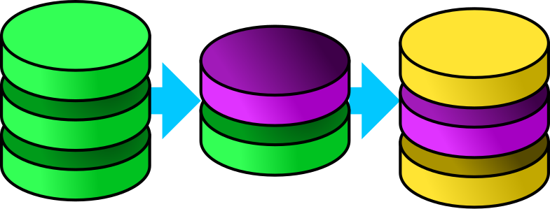

<p align="center">
    <!--<br>-->
    <a href="https://github.com/AlphaOne1/dmorph/actions/workflows/test.yml"
       rel="external"
       target="_blank">
        
    </a>
    <a href="https://github.com/AlphaOne1/dmorph/actions/workflows/codeql.yml"
       rel="external"
       target="_blank">
        
    </a>
    <a href="https://github.com/AlphaOne1/dmorph/actions/workflows/security.yml"
       rel="external"
       target="_blank">
        
    </a>
    <a href="https://goreportcard.com/report/github.com/AlphaOne1/dmorph"
       rel="external"
       target="_blank">
        
    </a>
    <a href="https://codecov.io/github/AlphaOne1/dmorph"
       rel="external"
       target="_blank">
        
    </a>
    <!--<a href="https://www.bestpractices.dev/projects/0000"
       rel="external"
       target="_blank">
        
    </a>-->
    <a href="https://scorecard.dev/viewer/?uri=github.com/AlphaOne1/dmorph"
       rel="external"
       target="_blank">
        
    </a>
    <a href="https://app.fossa.com/projects/git%2Bgithub.com%2FAlphaOne1%2Fdmorph?ref=badge_shield&issueType=license"
       rel="external"
       target="_blank">
        
    </a>
    <a href="https://app.fossa.com/projects/git%2Bgithub.com%2FAlphaOne1%2Fdmorph?ref=badge_shield&issueType=security"
       rel="external"
       target="_blank">
        
    </a>
    <a href="https://godoc.org/github.com/AlphaOne1/dmorph"
       rel="external"
       target="_blank">
        
    </a>
</p>

DMorph
======

*DMorph* (pronounced [diˈmɔʁf]) is a database migration library. Programs that use a database and
have to preserve the data between versions can utilize *DMorph* to apply the necessary migration
steps. If a program can afford to lose all data between version upgrades, this library is not
necessary.

Includes direct support for the following relational database management systems:

* [IBM Db2](https://www.ibm.com/db2/)
* [Microsoft SQL Server](https://www.microsoft.com/sql-server)
* [MySQL](https://www.mysql.com/) & [MariaDB](https://mariadb.org/)
* [Oracle Database](https://www.oracle.com/database/)
* [PostgreSQL](https://www.postgresql.org)
* [SQLite](https://www.sqlite.org)

Additional database management systems can be included providing the necessary queries.


Installation
------------

To install *DMorph*, you can use the following command:

```bash
$ go get github.com/AlphaOne1/dmorph
```


Getting Started
---------------

*DMorph* applies migrations to a database.
A migration is a series of steps, defined either in an SQL file or programmatically.


### Migration from File

A typical migration file consists of a sequence of SQL statements. Each statement needs to be
finalized with a semicolon `;`. If a semicolon is found alone at the beginning of a line, all
previous statements, that were not yet executed, are executed in one call to Exec in a
transaction. A migration is executed completely inside of a transaction. If any of the steps of
a migration fails, a rollback is issued and the process stops. Take care, that not all database
management systems offer a rollback of DDL (CREATE, DROP, ...) statements.

An example for a migration inside a file `01_base_tables` is as follows:

```sqlite
CREATE TABLE tab0 (
    id string PRIMARY KEY
)
;

CREATE TABLE tab1 (
    id string PRIMARY KEY
)
;
```

It can be applied to an already open database with the following snipped:

```go
package testprog

import (
    "database/sql"
    "github.com/AlphaOne1/dmorph"
)

func migrate(db *sql.DB) error {
    return dmorph.Run(db,
        dmorph.WithDialect(dmorph.DialectSQLite()),
        dmorph.WithMigrationFromFile("01_base_tables.sql"))
}

...
```

In this example just one file is used, the `WithMigrationFromFile` can be given multiple times.
Migrations are executed in alphabetical order of their key. For files the key is the file's name.
The `WithDialect` option is used to select the correct SQL dialect, as *DMorph* does not have
a means to get that information (yet).


### Migrations from Folder

As normally multiple migrations are to be executed, they can be assembled in a folder and then
executed together. As stated before, the order of multiple files is determined by their
alphabetically ordered name.

Taken the example from [above](#migration-from-file), split into two files, like prepared in
[testData/](testData/).

```go
package testprog

import (
    "database/sql"
    _ "embed"
    "io/fs"
    "github.com/AlphaOne1/dmorph"
)

//go:embed testData
var migrationFS embed.FS

func migrate(db *sql.DB) error {
    sub, subErr := fs.Sub(migrationFS, "testData") 
    
    if subErr != nil {
        return subErr
	}
    
    return dmorph.Run(db,
        dmorph.WithDialect(dmorph.DialectSQLite()),
        dmorph.WithMigrationsFromFS(sub.(fs.ReadDirFS)))
}

...
```

### Programmatic Migration

Sometimes SQL alone is not sufficient to achieve the migration desired. Maybe the data needs to be
programmatically changed, checked or otherwise processed. For *DMorph* a migration is presented as
an interface:

```go
type Migration interface {
    Key() string              // identifier, used for ordering
    Migrate(tx *sql.Tx) error // migration functionality
}
```

The `WithMigrationFromF...` family of options constructs these migrations for convenience. An example
migration fulfilling this interface could look like this:

```go
type CustomMigration struct {}

func (m CustomMigration) Key() string {
    return "0001_custom"
}

func (m CustomMigration) Migrate(tx *sql.Tx) error {
    _, err := tx.Exec(`CREATE TABLE tab0(id INTEGER PRIMARY KEY)`)
    return err
}
```

Inside of the `Migrate` function the transaction state should not be modified.
`Commit` and `Rollback` are handled by *DMorph* as needed. As seen in the example, a potentiel error
is returned plain to the caller.

This newly created migration can then be passed to *DMorph* as follows:

```go
func migrate(db *sql.DB) error {
    return dmorph.Run(db,
        dmorph.WithDialect(dmorph.DialectSQLite()),
        dmorph.WithMigrations(CustomMigration{}))
}
```

### New Database SQL Dialect

*DMorph* uses the Dialect interface to adapt to different database management systems:

```go
type Dialect interface {
    EnsureMigrationTableExists(db *sql.DB, tableName string) error
    AppliedMigrations(db *sql.DB, tableName string) ([]string, error)
    RegisterMigration(tx *sql.Tx, id string, tableName string) error
}
```

It contains a convenience wrapper, `BaseDialect`, that fits most database systems. It implements the
above functions using a set of user supplied SQL statements:

```go
type BaseDialect struct {
    CreateTemplate   string
    AppliedTemplate  string
    RegisterTemplate string
}
```

All the included SQL dialects use the `BaseDialect` to implement their functionality. The tests for
*DMorph* are done using the [SQLite dialect](dialect_sqlite.go).

As the migration table name can be user supplied, the statements need to have placeholders that will
fill the final table name. As there might be special characters, it is always enclosed in the
identifier enclosing characters of the database.

*DMorph* uses the `ValidTableNameRex` regular expression, to check if a table name is principally
valid. The regular expression may be adapted, but it is strongly advised to only do so in pressing
circumstances.