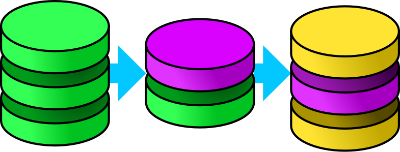

    <!-- -->
    
    
    
    
    
    <!---->
    
    
    
    

DMorph
======

*DMorph* is a database migration library.

Includes direct support for the following relational database management systems:

* [IBM Db2](https://www.ibm.com/db2/)
* [Oracle Database](https://www.oracle.com/database/)
* [Microsoft SQL Server](https://www.microsoft.com/sql-server)
* [MySQL](https://www.mysql.com/) & [MariaDB](https://mariadb.org/)
* [PostgreSQL](https://www.postgresql.org)
* [SQLite](https://www.sqlite.org)

Additional database management systems can be included providing the necessary queries.
